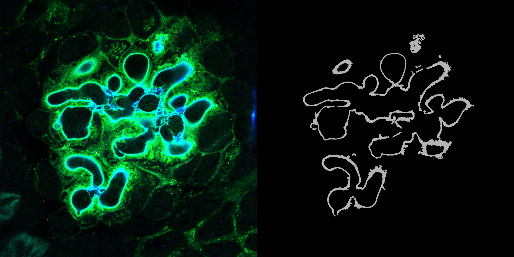
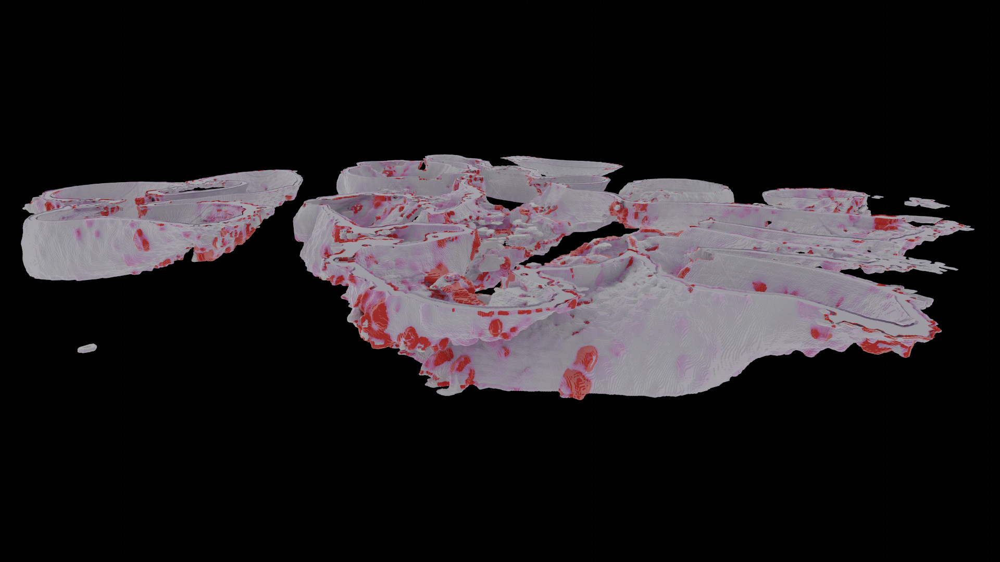

# GBM 3D-Segmentation and Reconstruction

## Introduction

This project is a work in progress.

In collaboration with KTH Royal Institute of Technology, we aim to leverage deep learning and high-resolution microscopy to invent a novel technique for nano-scale 3D segmentation and reconstruction of Glomerular Basement Membrane (GBM), a ribbon-like extracellular matrix that lies between the endothelium and the podocyte foot processes.

<div align="center" width="100%">
    
</div>

Additionally, we focus on developing GPU-based algorithms to extract useful morphometric features from the 3D reconstruction to acquire a better understanding of GBM's role as a filtration barrier and its alteration in pathological scenarios.


<div align="center" width="100%">
    
</div>


## Installation

(Add installation instructions here)

## How to Use

This application has its own experiment management system. Users can create different experiments using command line options, train the model based on the provided datasets and chosen configuration, and also perform inference and visualize the results based on the trained model.

### Command Line Interface

The application uses a command-line interface with several subcommands. Here's a detailed breakdown of the available commands and their options:

#### Global Options

- `-d`, `--debug`: Enable debugging mode

#### List Experiments

List created experiments or snapshots of a specific experiment.

```
python main.py list [-r] [-s SNAPSHOTS]
```

Options:
- `-r`, `--root`: Specify the root directory of experiments
- `-s SNAPSHOTS`, `--snapshots SNAPSHOTS`: List the snapshots of a specific experiment

#### Create a New Experiment

Create a new experiment with the given name.

```
python main.py create <name> [-bs BATCH_SIZE]
```

Options:
- `-bs BATCH_SIZE`, `--batch-size BATCH_SIZE`: Set the batch size for training (default: 8)

#### Delete an Experiment

Delete the selected experiment.

```
python main.py delete <name>
```

#### Train an Experiment

Start or continue training for the specified experiment.

```
python main.py train <name>
```

#### Run Inference

Create an inference session for the specified experiment.

```
python main.py infer <name> -s SNAPSHOT [-bs BATCH_SIZE] [-sd SAMPLE_DIMENSION] [-st STRIDE] [-sf SCALE_FACTOR]
```

Options:
- `-s SNAPSHOT`, `--snapshot SNAPSHOT`: Select the snapshot for inference (required)
- `-bs BATCH_SIZE`, `--batch-size BATCH_SIZE`: Set the batch size for inference (default: 8)
- `-sd SAMPLE_DIMENSION`, `--sample-dimension SAMPLE_DIMENSION`: Set sample dimension for inference (default: '12, 256, 256')
- `-st STRIDE`, `--stride STRIDE`: Set the stride for inference (default: '1, 64, 64')
- `-sf SCALE_FACTOR`, `--scale-factor SCALE_FACTOR`: Set the scale for interpolation (default: 1)

### Configuration

The application uses a YAML configuration file located at `./configs/template.yaml`. This file contains various settings such as the root directory for experiments and other parameters.

### Examples

1. Create a new experiment:
   ```
   python main.py create my_experiment --batch-size 16
   ```

2. List all experiments:
   ```
   python main.py list
   ```

3. Train an experiment:
   ```
   python main.py train my_experiment
   ```

4. Run inference:
   ```
   python main.py infer my_experiment --snapshot best_model --batch-size 4 --sample-dimension "24, 512, 512" --stride "2, 128, 128" --scale-factor 2
   ```

## Debugging

Add the `--debug` flag to any command to enable debugging mode.

## Requirements

(Add any specific hardware or software requirements here)