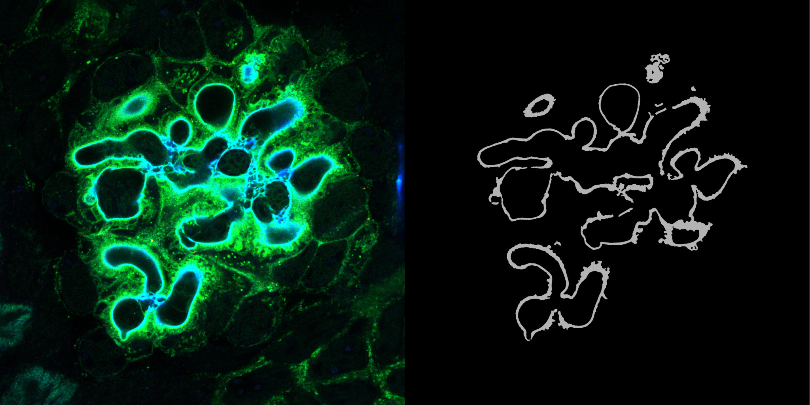
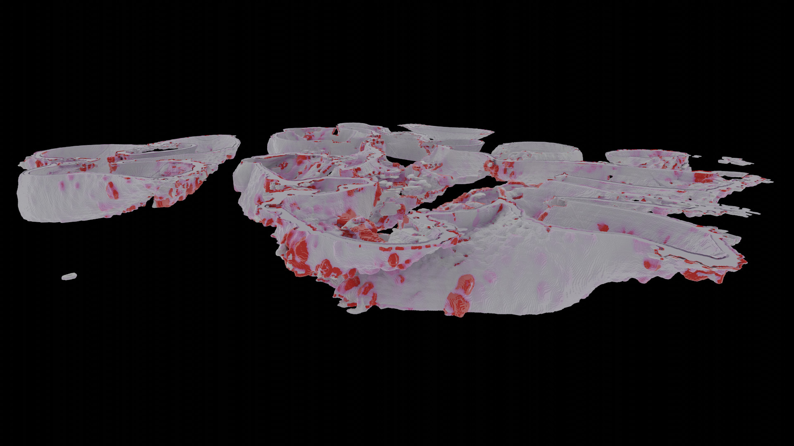

# GBM 3D-Segmentation and Reconstruction

## Introduction

This project is a work in progress.

We aim to leverage deep learning and high-resolution microscopy to invent a novel technique for nano-scale 3D segmentation and reconstruction of Glomerular Basement Membrane (GBM), a ribbon-like extracellular matrix that lies between the endothelium and the podocyte foot processes.

<br/>

<p align="center">
  
</p>

<br/>

Additionally, we focus on developing GPU-based algorithms to extract useful morphometric features from the 3D reconstruction to acquire a better understanding of GBM's role as a filtration barrier and its alteration in pathological scenarios.

<br/>

<p align="center">
  
</p>

<br/>

## Installation

1.  **Clone the repository:**
    ```bash
    git clone <repository-url>
    cd gbm-seg
    ```

2.  **Create a Python virtual environment:**
    ```bash
    python3 -m venv venv
    source venv/bin/activate
    ```

3.  **Install the dependencies:**
    ```bash
    pip install -r requirements.txt
    ```

4.  **Install Blender:**
    For 3D visualization, you need to have Blender installed and available in your system's PATH.

## Hardware Requirements

The project was developed and tested on servers equipped with:

-   **GPUs:** 4x NVIDIA A100 or 4x NVIDIA V100 GPUs
-   **CPU:** 64-core AMD EPYC processors
-   **RAM:** 500+ GB

## Usage

This application features an experiment management system accessible via the `gbm.py` command-line interface. Users can create, train, and manage experiments, perform inference, and visualize results. The workflow is designed to be flexible, supporting both local execution and SLURM-based job submission.

### Configuration

The application uses a YAML configuration file located at `./configs/template.yaml`. This file is the *template* — `gbm.py create` renders it into a per-experiment `configs.yaml` at experiment-create time, after which each experiment reads its own copy (template edits don't retroactively affect old experiments). Before running anything, review the template and adjust paths + parameters to your environment.

Key tunable sections of the template:

- `experiments.root` — where created experiments live (cluster vs. laptop toggle near the top).
- `trainer.model.name` — dispatched through a registry; defaults to `unet_3d`. New models register in `src/models/__init__.py`.
- `trainer.loss` — one of `Dice`, `IoU`, `CrossEntropy`, `Cont`, or `Compound` (weighted sum of other losses; see Ablation Studies below).
- `trainer.optim.name` — `adam` (default) or `sgd` (with momentum / Nesterov / weight-decay fields).
- `trainer.scheduler.name` — `poly_decay` (default) or `none`. Set `scheduler: null` or omit `name` to keep the default. Stepped once per epoch.
- `trainer.deep_supervision.enabled` — toggle decoder mid-level auxiliary heads (off by default).
- `trainer.wandb.{enabled, project, entity, run_name}` — opt-in Weights & Biases experiment tracking.
- `inference.stitching` — sliding-window stitching mode (`gaussian` / `hann` / `sum_logits` / `flat_softmax`).
- `inference.morph.thickness_clip_max` — threshold (nm) for `gbm.py stats --clipping`.

For each new experiment, `gbm.py create` also writes:

- `configs.yaml` (the rendered template),
- `fold_assignments.yaml` (subject-wise stratified 5-fold partition, deterministic from a fixed seed),
- `requirements.txt`, `git_sha.txt`, and (if the tree is dirty) `git_diff.patch` for reproducibility.

### Local Execution (Without SLURM)

The `gbm.py` script provides a command-line interface for managing experiments directly on your local machine or a non-SLURM environment.

#### Global Options

- `-d`, `--debug`: Enable debugging mode

#### List Experiments

List created experiments or snapshots of a specific experiment.

```bash
python gbm.py list [-r] [-s SNAPSHOTS]
```

Options:
- `-r`, `--root`: Specify the root directory of experiments
- `-s SNAPSHOTS`, `--snapshots SNAPSHOTS`: List the snapshots of a specific experiment

#### Create a New Experiment

Create a new experiment with the given name.

```bash
python gbm.py create <name> [-bs BATCH_SIZE]
```

Options:
- `-bs BATCH_SIZE`, `--batch-size BATCH_SIZE`: Set the batch size for training (default: 8)

#### Delete an Experiment

Delete the selected experiment. Requires `-f/--force` (non-interactive — there is no confirmation prompt, so SLURM jobs that delete won't hang).

```bash
python gbm.py delete <name> -f
```

#### Train an Experiment

Start or continue training for the specified experiment. Pick which CV fold to train via `--fold` (default `0`); the partition lives in `<experiment>/fold_assignments.yaml`, generated at create time.

```bash
python gbm.py train <name> [--fold 0..4]
```

Options:
- `--fold FOLD`: Which subject-wise stratified fold (0..k-1) to train. Defaults to `0`.

To get publication-ready mean ± std, submit one job per fold (a SLURM array typically) and aggregate.

#### Run Inference

Create an inference session for the specified experiment. Refuses to overwrite an existing inference dir without `-f/--force` (also non-interactive).

```bash
python gbm.py infer <name> -s SNAPSHOT [-bs BATCH_SIZE] [-sd SAMPLE_DIMENSION] [-st STRIDE] [-sf SCALE_FACTOR] [-f]
```

Options:
- `-s SNAPSHOT`, `--snapshot SNAPSHOT`: Select the snapshot for inference (required).
- `-bs BATCH_SIZE`, `--batch-size BATCH_SIZE`: Set the batch size for inference (default: 8).
- `-sd SAMPLE_DIMENSION`, `--sample-dimension SAMPLE_DIMENSION`: Set sample dimension for inference (default: `'12, 256, 256'`).
- `-st STRIDE`, `--stride STRIDE`: Set the stride for inference (default: `'1, 64, 64'`).
- `-sf SCALE_FACTOR`, `--scale-factor SCALE_FACTOR`: Set the Z-axis interpolation scale (default: 1).
- `-f`, `--force`: Overwrite an existing inference output directory.

The stitching mode used by inference is read from the experiment's `configs.yaml` (`inference.stitching`). New experiments default to `gaussian`; existing experiments preserve their original behaviour (`sum_logits` if absent).

#### Post-processing

Perform post-processing to remove noise and artifacts from inference results.

```bash
python gbm.py psp <name> -it INFERENCE_TAG -mc MAX_CONCURRENT
```

Options:
- `-it INFERENCE_TAG`, `--inference-tag INFERENCE_TAG`: Tag of the inference session to process.
- `-mc MAX_CONCURRENT`, `--max-concurrent MAX_CONCURRENT`: Number of concurrent processes for post-processing.

#### Morphometric Analysis

Perform morphometric analysis on a processed sample.

```bash
python gbm.py morph <name> -it INFERENCE_TAG -sn SAMPLE_NAME
```

Options:
- `-it INFERENCE_TAG`, `--inference-tag INFERENCE_TAG`: Tag of the inference session.
- `-sn SAMPLE_NAME`, `--sample-name SAMPLE_NAME`: Name of the sample to analyze.

#### Prepare Blender Visualizations

Prepare data for Blender visualizations.

```bash
python gbm.py blender <name> -it INFERENCE_TAG -sn SAMPLE_NAME
```

Options:
- `-it INFERENCE_TAG`, `--inference-tag INFERENCE_TAG`: Tag of the inference session.
- `-sn SAMPLE_NAME`, `--sample-name SAMPLE_NAME`: Name of the sample for visualization.

#### Render Blender Visualizations

Render Blender visualizations.

```bash
python gbm.py render <name> -it INFERENCE_TAG
```

Options:
- `-it INFERENCE_TAG`, `--inference-tag INFERENCE_TAG`: Tag of the inference session.

#### Export Results

Export inference and analysis results.

```bash
python gbm.py export <name> -it INFERENCE_TAG
```

Options:
- `-it INFERENCE_TAG`, `--inference-tag INFERENCE_TAG`: Tag of the inference session.

#### Generate Statistics

Generate statistics from the analysis results.

```bash
python gbm.py stats <name> -it INFERENCE_TAG [--clipping]
```

Options:
- `-it INFERENCE_TAG`, `--inference-tag INFERENCE_TAG`: Tag of the inference session.
- `--clipping`: Discard thickness values above `inference.morph.thickness_clip_max` (default 1400 nm) before computing the histograms. Useful for visually pathological samples; the rate of clamped voxels also appears per-sample in `metadata.txt` regardless of this flag.

#### Examples for Local Execution

1.  **Create a new experiment** (this also generates `fold_assignments.yaml` from the copied `ds_train/`):
    ```bash
    python gbm.py create my_experiment --batch-size 16
    ```

2.  **List all experiments:**
    ```bash
    python gbm.py list
    ```

3.  **Train fold 0:**
    ```bash
    python gbm.py train my_experiment --fold 0
    ```

    For 5-fold cross-validation, submit each fold separately (locally in sequence, or as a SLURM array):
    ```bash
    for f in 0 1 2 3 4; do python gbm.py train my_experiment --fold "$f"; done
    ```

4.  **Run inference:**
    ```bash
    python gbm.py infer my_experiment --snapshot 020-30000.pt --batch-size 4 --sample-dimension "24, 512, 512" --stride "2, 128, 128" --scale-factor 2
    ```

### SLURM Execution

For environments utilizing the SLURM workload manager, the project provides scripts to submit jobs for various tasks, especially for the full inference pipeline. Individual SLURM job scripts are located in the `sbatch/` directory.

#### Inference Pipeline using `gbm_inference.sh`

The `gbm_inference.sh` script provides a convenient way to run a complete inference pipeline, which includes:
1.  Inference
2.  Post-processing (noise removal)
3.  Morphometric analysis
4.  Blender visualization

This script will submit a series of dependent SLURM jobs to perform the entire inference workflow.

**Usage:**
```bash
./gbm_inference.sh --name=<project_name> --snapshot=<snapshot_file> --batch-size=<batch_size> --sample-dimension=<dims> --stride=<stride> --scale-factor=<factor>
```

**Example:**
```bash
./gbm_inference.sh --name=my_experiment --snapshot=002-2920.pt --batch-size=4 --sample-dimension='12, 256, 256' --stride='1, 64, 64' --scale-factor=6
```

#### Individual SLURM Job Submission

You can also submit individual jobs using the scripts in the `sbatch/` directory. For example, to submit an inference job:

```bash
sbatch ./sbatch/infer.sbatch <name> <snapshot> <batch_size> "<sample_dimension>" "<stride>" <scale_factor>
```
Refer to the specific `.sbatch` files for their required arguments and usage.

#### Create as a SLURM job

`gbm.py create` copies the source tree, resizes every default-dataset TIFF, and snapshots pip+git state — too heavy for the login node. Run it on the cpu partition:

```bash
sbatch sbatch/create.sbatch <name>
```

#### Multi-node DDP Training

`sbatch/launch_multi_node.sh` discovers the right nodes and fires a multi-node DDP training job spanning them. Two modes:

**Explicit** — you specify the pool:

```bash
sbatch/launch_multi_node.sh <name> --nodes lyn-gpu-03,lyn-gpu-05 --gpus 4
sbatch/launch_multi_node.sh <name> --nodes lyn-gpu-07,lyn-gpu-08 --gpus 2
```

**Auto-arch** — pick whichever pool currently has the most free GPUs:

```bash
sbatch/launch_multi_node.sh <name> --arch A100        # explicit arch
sbatch/launch_multi_node.sh <name> --arch V100
sbatch/launch_multi_node.sh <name> --arch auto        # picks A100 vs V100 by free count
```

Options (defaults shown):
- `--epochs N` — override `trainer.optimization.epochs`.
- `--cpus N` — per-task CPU count (default: `8 × gpus-per-node`, capped at min-free across the pool).
- `--mem N[G|M]` — memory per node (default: 90% of min-free).
- `--partition P` — SLURM partition (default: `train`). For other clusters.
- `--dry-run` — show the would-be `sbatch` command and exit.

The launcher reads each node's *free* CPU/mem/GPU via `scontrol show node` and sizes per-task resources accordingly — avoids the "request larger than the smallest-free node can grant, queue indefinitely" trap. The arch-auto mode also automatically excludes nodes with 0 free GPUs from the pool.

Per-rank work stays uniform across the pool (`min(free GPUs)` per node). For an 8-GPU lg6-only run use `sbatch/train_all_data_lg6.sbatch` — the multi-node launcher would cap lg6 at 4 GPUs to match smaller A100 peers in the pool.

The two arch pools are mutually exclusive (A100 nodes vs V100 nodes), so two of these can run concurrently — a future ablation campaign can compare arches in parallel.

## Ablation Studies

The `ablate` subcommand materialises one experiment per cell of a study, ready to submit. See `ablation_specs/` for working templates (`loss_pilot.yaml`, `ds_pilot.yaml`).

A spec describes one study as a list of cells (each varying some axes via dotted-path config overrides) plus the folds to run:

```yaml
study: loss_pilot
base_experiment: my_baseline          # must already exist (gbm.py create)
cells:
  - name: dice
    overrides: {trainer.loss: Dice}
  - name: dice_ce
    overrides:
      trainer.loss: Compound
      trainer.compound_loss:
        - {name: Dice, weight: 1.0}
        - {name: CrossEntropy, weight: 1.0}
folds: [0]                             # pilot; switch to [0, 1, 2, 3, 4] for the final
```

Run the orchestrator:

```bash
python gbm.py ablate ablation_specs/loss_pilot.yaml
```

For each `(cell, fold)`, the orchestrator creates an experiment under `experiments.root` named `<study>__<cell>__fold<n>`. Datasets and code are symlinked from the base experiment (no GB-scale copies for 25 cells); fold assignments and provenance files are copied. Only the per-cell `configs.yaml` is rewritten with the overrides applied and a unique `trainer.wandb.run_name`.

The orchestrator prints the exact training commands — submit them yourself (interactively, or wrap in `sbatch`):

```
python gbm.py train loss_pilot__dice__fold0 --fold 0
python gbm.py train loss_pilot__dice_ce__fold0 --fold 0
...
```

If you have a SLURM submission wrapper script, point `--sbatch` at it:

```bash
python gbm.py ablate ablation_specs/loss_pilot.yaml --sbatch ./sbatch/train.sbatch
# Emits: sbatch ./sbatch/train.sbatch loss_pilot__dice__fold0 0
```

Re-running `ablate` over an existing set of cells is idempotent — already-materialised cell directories are left alone.

The recommended workflow is **sequential pinning**: pilot each axis (loss → optimiser → deep supervision) on one fold, pick the winner, pin it in the base experiment, move to the next axis. Stitching is "free" — one trained snapshot produces a result for each of the four stitching modes via inference fan-out without re-training.

## Experiment Tracking (Weights & Biases)

Setting `trainer.wandb.enabled: true` in `configs.yaml` enables per-step metric logging + snapshot artifact uploads to a W&B run. The full `configs` dict is logged as `wandb.config` so every ablation axis (model × loss × stitching × optimiser × fold) is filterable on the W&B UI.

**The chart x-axis is `samples`, not raw step count.** `trainer.logging.report_freq` is interpreted at a reference effective batch of 8 — internally the actual step interval scales by `8 / effective_batch_size` so the number of samples between reports stays constant. So `report_freq: 1000` always means "report every 8000 samples" regardless of `batch_size × world_size`. Curves from runs with different effective batches line up directly on the W&B UI (same applies to the local console logs: `train, Epoch: 1, Samples: 8000, Metrics: {...}`). See `Factory._scaled_freq_steps` and the `wandb.define_metric` calls in `train.py:maybe_init_wandb`.

Authentication options:

```bash
# Interactive (stores in ~/.netrc):
wandb login

# Or via env var (best for SLURM):
export WANDB_API_KEY=<your_key>     # get from https://wandb.ai/authorize

# Or fully offline (no network; sync later with `wandb sync`):
export WANDB_MODE=offline
```

If wandb isn't installed, the training pipeline logs a warning and continues without it — never aborts.

## Internals Worth Knowing

A few non-obvious design choices that surface when debugging slow training or comparing runs:

- **Volumes are lazy-loaded.** `GBMDataset.__init__` does NOT pre-read every training file + augmented variant into RAM (the pre-refactor design did, which OOM'd on V100 nodes with offline aug enabled). Each `__getitem__` reads the relevant TIFF from disk on demand. A single-entry per-worker cache (`_load_image`) keeps the just-loaded file resident so consecutive accesses to the same file hit the cache. See `src/data/ds_train.py`.

- **`shuffle: true` uses a file-block-random sampler.** Combined with the lazy load + single-entry cache, this means each worker reads each of its assigned files exactly once per epoch — instead of ~N reads per file under fully-random shuffling. Files are shuffled, patches within each file are shuffled, but the iteration emits one file's patches contiguously before moving on. Under DDP the files (not flat indices) are partitioned across ranks, so the block structure is preserved within each rank. See `src/data/samplers.py:FileBlockRandomSampler`.

- **The LR scheduler is poly_decay only.** `ReduceLROnPlateau` was removed (it was the source of CV mode silently decaying per-step instead of per-epoch). `poly_decay` advances once per epoch at the end of `trainEpoch`, in both all-data and CV modes. Set `trainer.optimization.scheduler: null` (or `{name: none}`) to disable LR scheduling entirely.

- **DDP LR scaling is automatic.** `Factory.createOptimizer` scales the base LR by `√world_size` for Adam and by `world_size` for SGD before the optimizer is constructed — going from 4 GPUs to 16 GPUs just works without a config change.

- **Offline aug must be precomputed.** With `enabled_offline: true`, `gbm.py offline-aug <name>` must run once before training; the cache lives at `<exp>/datasets/ds_train/cache/`. Training itself never recomputes the cache (DDP would have every rank recompute simultaneously → swap death). For a new experiment that should reuse an existing cache: `cp -al <src>/datasets/ds_train/cache <dst>/datasets/ds_train/cache` (hardlinks, same filesystem, instant).

## Reproducibility

Each `gbm.py create` writes `git_sha.txt` and (if dirty) `git_diff.patch` into the experiment dir. Each `gbm.py train --fold N` invocation seeds Python/NumPy/PyTorch/CUDA + dataloader workers from a fixed seed (`88233474`), and enables `torch.use_deterministic_algorithms(True, warn_only=True)` with `CUBLAS_WORKSPACE_CONFIG=:4096:8` for bit-exact reproducibility on CUDA. Expect a ~5–10% speed regression in exchange.

Per-snapshot `<epoch>-<step>.yaml` model cards are written next to each `.pt` file, capturing the torch/CUDA/cuDNN versions, GPU name, Python version, the torch RNG seed, git SHA, and the experiment name. Useful months later when reconstructing how a snapshot was produced.

## Testing

The test suite runs on CPU and does not need a real dataset (synthetic fixtures throughout):

```bash
python -m pytest tests/                       # full suite
python -m pytest tests/ --cov=src             # with coverage
python -m ruff check .                        # lint
```

## Debugging

Add the `--debug` flag to any command to enable interactive debugging via `pudb`.

## Project history

See [`PLAN.md`](PLAN.md) for the planning ledger covering the bug-fix overhaul, the methodology-review backlog (25 catalogued items with decisions and rationale), and the implementation status of each.
